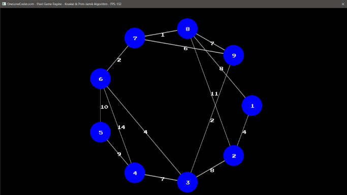
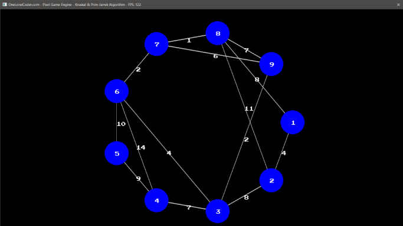

# graph-algorithms-visualization

Graph algorithms visualization made using olcPixelGameEngine (Visual Studio 2015 Project)

Currently supported algorithms:
 * Prim-Jarnik
 * Kruskal
 
## Kruskal algorithm visualization

## Prim-Jarnik algorithm visualization

 
## Controls

Press `Enter` to move to the next frame of the animation.  
If you want animation to be played automatically, set **_USER_ANIMATION_CONTROL_** macro to **0** (defined in Main.cpp)  
To control the speed of the animation, set **_TIME_BETWEEN_FRAMES_** macro to desired value (in seconds).  
To change which algorithm will be used, set **_m_Type_** attribute of the **_GraphAlgorithms_** class to desired value.
