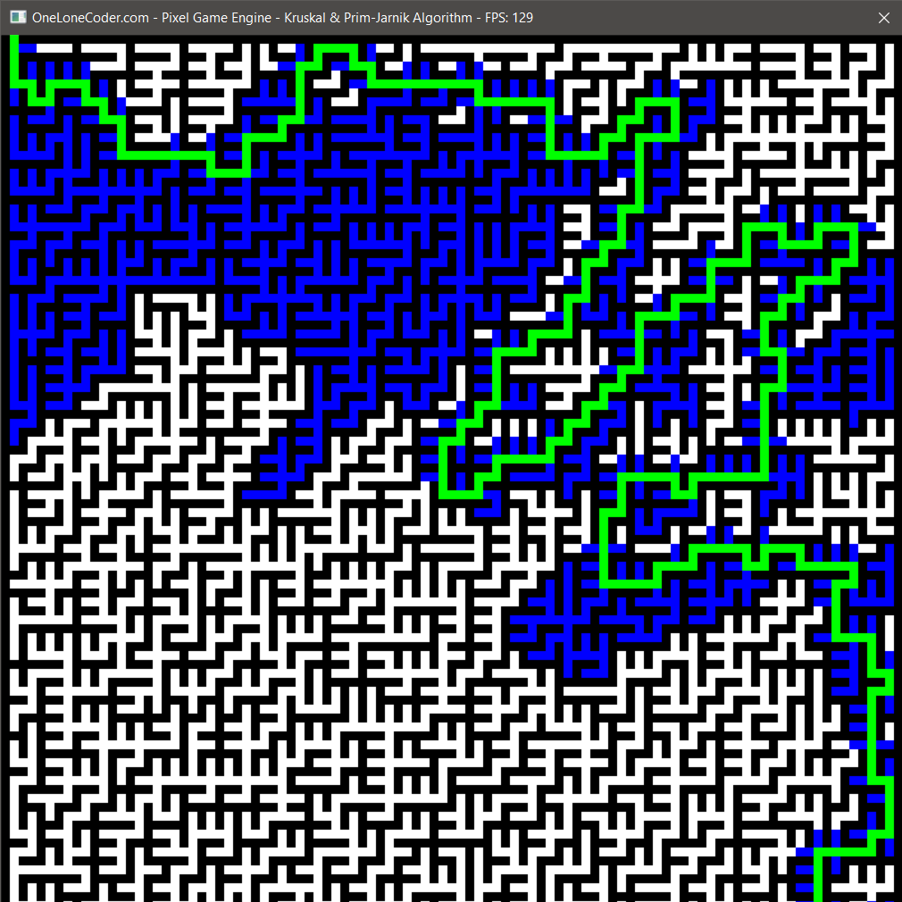
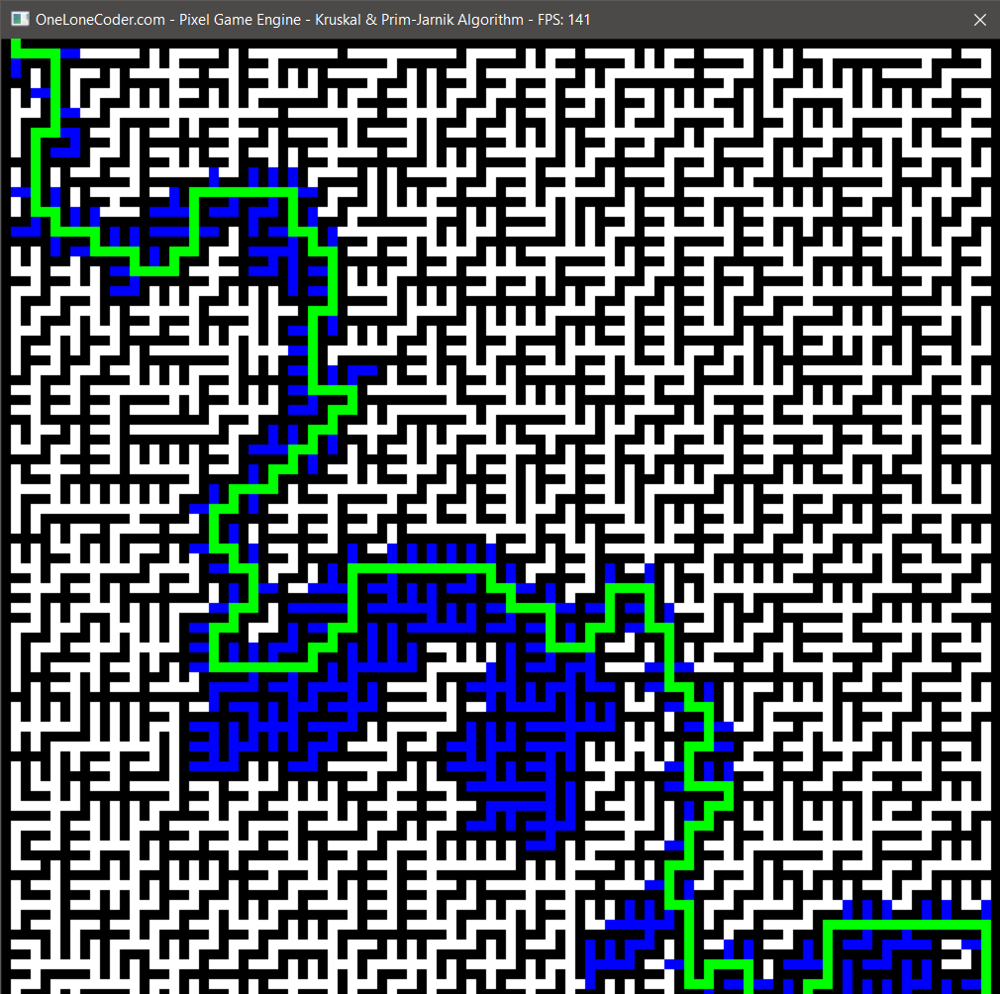
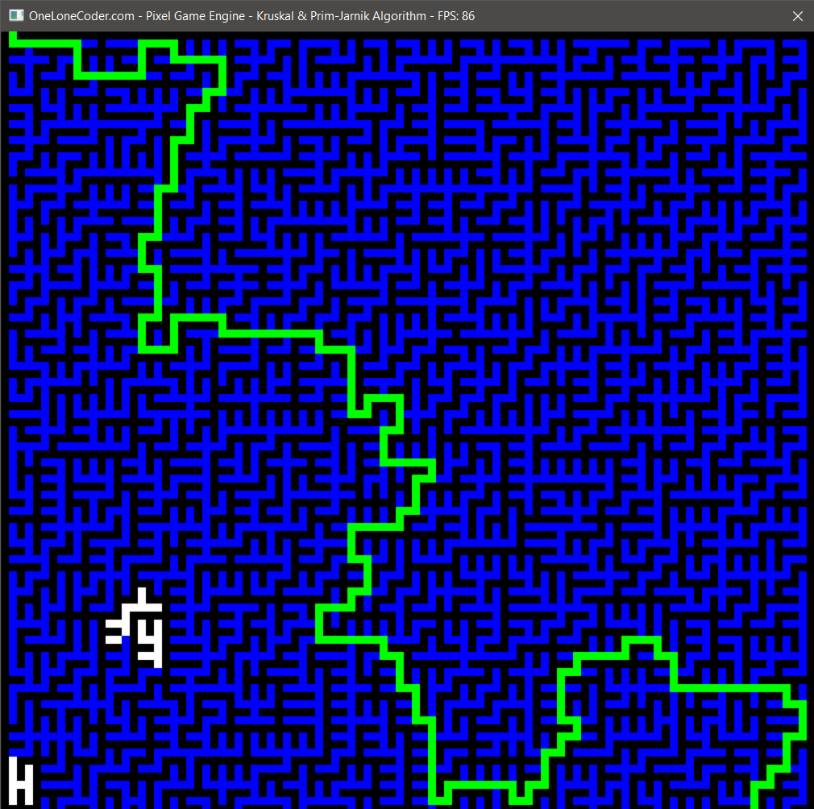
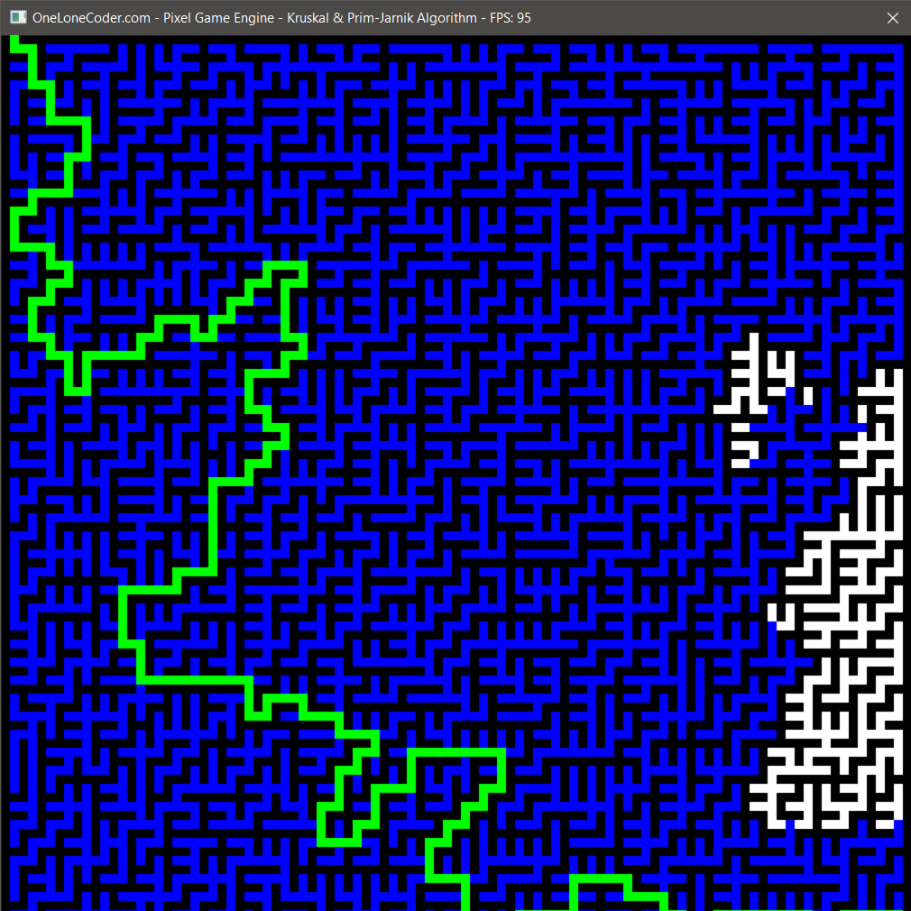
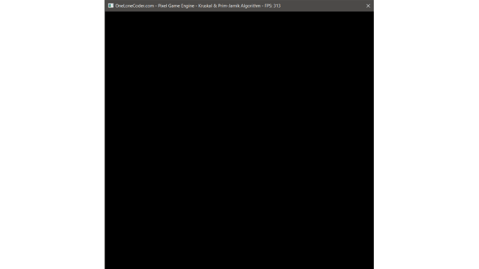

# graph-algorithms-visualization

Graph algorithms visualization made using olcPixelGameEngine (Visual Studio 2015 Project)

Currently supported algorithms:
 * Prim-Jarnik MST
 * Kruskal MST
 * Boruvka MST
 * Prim-Jarnik MST maze generation
 * Kruskal MST maze generation
 * Boruvka MST maze generation
 * DFS
 * BFS
 * Dijkstra
 * A*
 
## Dijkstra's algorithm - Maze solving example

## A* algorithm - Maze solving example

## DFS algorithm - Maze solving example

## BFS algorithm - Maze solving example

 
## Kruskal algorithm visualization example

## Prim-Jarnik algorithm visualization example

## Kruskal MST maze generation example

## Prim-Jarnik MST maze generation example
 
 
 
## Controls

Press `Enter` to move to the next frame of the animation.  
If you want animation to be played automatically, set **_USER_ANIMATION_CONTROL_** macro to **0** (defined in Main.cpp).  
To generate a maze, set **_DRAW_MAZE_** macro to **1** (by default it is 0) and, optionally, configure maze parameters (_MAZE_GRAPH_VERTICES_, _VERTEX_SCALE_).  
To control the speed of the animation, set **_TIME_BETWEEN_FRAMES_** macro to desired value (in seconds).  
To change which algorithm will be used for MST (or maze generation), set **_m_Type_** attribute of the **_GraphAlgorithms_** class to desired value. 
To change which algorithm will be used for maze solving, set **_m_PathType_** attribute of the **_GraphAlgorithms_** class to desired value.

## License

This program is free. 
You can redistribute it and/or change it under the terms of **GNU General Public License version 3.0** (GPLv3).  
You can find a copy of the license in the repository.
